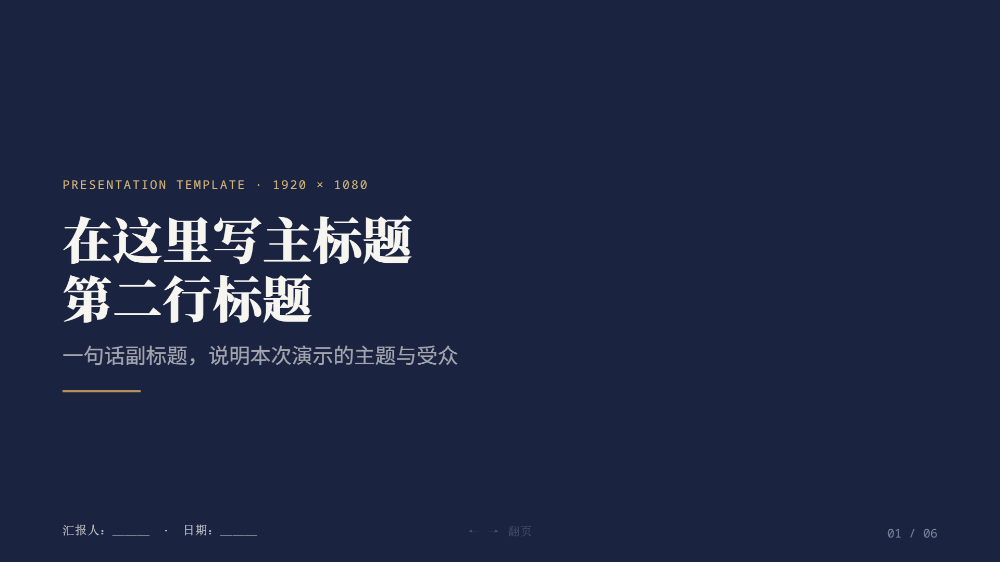

# html-keynote-deck

单文件、零构建的 **HTML 演示文稿模板**（1920×1080）。一个 `presentation.html` 即完整可播放：内置自适应舞台、20+ 动画原语、分步揭示，以及内建的可视化编辑器（点选/拖拽/缩放/改字/撤销/导出）。



## 依赖需求

- **Node.js ≥ 14**：仅用于本地预览服务器；直接双击 `presentation.html` 用浏览器打开则**不需要 Node**。
- **现代浏览器**：Chrome / Edge / Firefox 任一。
- **无需 `npm install`、无需构建、无第三方运行时依赖**。字体（思源/Noto）与 lucide 图标走 CDN，离线时静默降级为系统字体与纯文本，不影响播放。

## 快速开始

```powershell
cd assets
node preview-server.js        # 或双击 启动预览服务器.bat
# 浏览器打开 http://127.0.0.1:8765/presentation.html
```

播放按 `→`/空格翻页，按 `E` 进入可视化编辑，按 `S` 导出干净的 HTML。

## 目录结构

```
html-keynote-deck/
├─ SKILL.md            # 给智能体的技能说明（frontmatter 元数据）
├─ AGENT.md            # 其它 agent 的快速上手手册
├─ README.md
├─ docs/
│  └─ screenshot-cover.png
└─ assets/
   ├─ presentation.html   # 模板本体（复制它做新演示）
   ├─ preview-server.js   # 本机静态服务器（127.0.0.1:8765）
   └─ 启动预览服务器.bat
```

## 做一份新演示

复制 `assets/presentation.html`，增删 `<div class="step">` 块即可；页数与进度由脚本自动统计。组件类、动画类、设计令牌见 `AGENT.md`。
